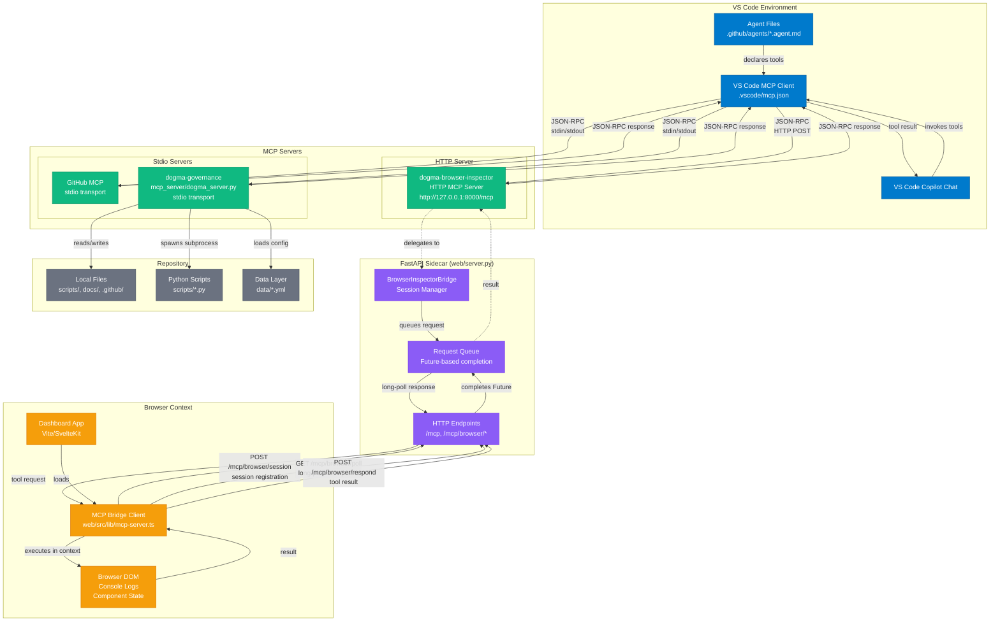
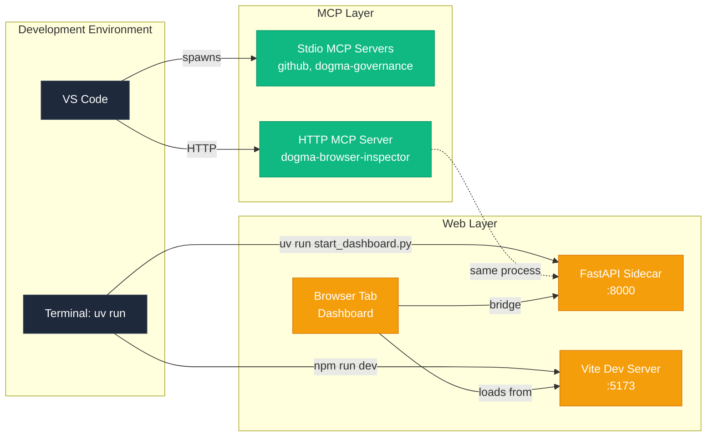

# MCP Ecosystem Architecture

This document provides a visual overview of the Model Context Protocol (MCP) surfaces in the dogma repository, their interconnections, and information flows.

## System Overview



## Tool Inventory

### GitHub MCP Server (stdio)
- Standard GitHub operations
- Issue/PR management
- Repository queries

### dogma-governance MCP Server (stdio)
13 governance tools operating on local repository:

1. **check_substrate** - Validate repo health before session start
2. **validate_agent_file** - Check .agent.md compliance
3. **validate_synthesis** - Check research doc structure
4. **scaffold_agent** - Generate new .agent.md stub
5. **scaffold_workplan** - Generate docs/plans/ skeleton
6. **run_research_scout** - SSRF-safe external URL fetch
7. **query_docs** - BM25 search over docs corpus
8. **prune_scratchpad** - Initialize/inspect session scratchpad
9. **normalize_path** - Validate and normalize file paths
10. **resolve_env_path** - Resolve environment-aware paths
11. **detect_user_interrupt** - Check for STOP/ABORT signals
12. **get_trace_health** - Session trace diagnostics
13. **route_inference_request** - Provider selection for inference

### dogma-browser-inspector MCP Server (HTTP)
5 browser inspector tools operating via bridge:

1. **ping** - Health check for browser bridge connection
2. **query_dom** - Execute CSS selectors in live browser context
3. **get_console_logs** - Retrieve browser console messages
4. **get_component_state** - Inspect Svelte/framework component state
5. **trigger_action** - Simulate user interactions (click, input, etc.)

## Information Flow Patterns

### Pattern 1: Governance Tool Invocation
```
Agent → VS Code Copilot → MCP Client → dogma-governance (stdio) → Scripts/Files → Result → MCP Client → Copilot
```

**Example**: `check_substrate` validates `.agent.md` files, research docs, and scripts, returns health summary.

### Pattern 2: Browser Inspection Tool Invocation
```
Agent → VS Code Copilot → MCP Client → dogma-browser-inspector HTTP Server → Bridge Queue → 
Browser Poll → Execute in DOM → Respond → Complete Future → Result → MCP Client → Copilot
```

**Example**: `query_dom` with selector `button.submit` queries live dashboard, returns element properties.

### Pattern 3: Bridge Session Lifecycle
```
Dashboard Load → Register Session → Long-Poll Loop → 
(a) Tool Request → Execute → Respond → Continue Poll
(b) Session Expiry (404) → Rebind → Continue Poll
(c) Error → Rebind → Continue Poll
```

### Pattern 4: Cross-Tool Coordination
```
Orchestrator → check_substrate (governance) → validate files
           ↘ query_dom (browser) → inspect dashboard state
           ↘ query_docs (governance) → search prior findings
           → Synthesize results → Return to user
```

## Transport Comparison

| Server | Transport | Spawn | Connection | Pros | Cons |
|--------|-----------|-------|------------|------|------|
| **dogma-governance** | stdio | VS Code spawns process | stdin/stdout JSON-RPC | Fast, reliable, no network | Single process lifecycle |
| **github** | stdio | VS Code spawns | stdin/stdout JSON-RPC | Standard, secure | Limited to gh CLI capabilities |
| **dogma-browser-inspector** | HTTP | User spawns sidecar | Long-lived HTTP | Multi-client, browser bridge | Requires port, async complexity |

## Security Boundaries

### Stdio Servers (github, dogma-governance)
- **Process boundary**: Spawned by VS Code, inherits env
- **File access**: Full workspace access via relative paths
- **Network**: Limited to tool-specific operations (gh API, SSRF-guarded fetches)
- **Validation**: Path safety via `mcp_server/_security.py` (normalize_path, validate_repo_path)

### HTTP Server (dogma-browser-inspector)
- **Network boundary**: Listens on 127.0.0.1:8000 (localhost only)
- **Session isolation**: Single active bridge session (newest wins)
- **Cross-origin**: Browser same-origin policy enforced
- **Error handling**: JSON-RPC -32700 (parse error), -32600 (invalid request)

### Browser Bridge
- **Execution context**: Runs in dashboard browser tab (untrusted from MCP perspective)
- **Tool whitelisting**: Only 5 approved tools exposed
- **Result validation**: Results flow through sidecar before returning to VS Code
- **Rebind mechanism**: 404/error triggers session re-registration (prevents stale sessions)

## Agent Tool Access Matrix

| Agent | dogma-governance | dogma-browser | github |
|-------|-----------------|----------------|--------|
| **Executive Orchestrator** | ✅ All 13 tools | ✅ All 5 tools | ✅ Issue/PR ops |
| **Executive Docs** | ✅ Subset (validate, query) | ❌ None | ❌ None |
| **Executive Fleet** | ✅ Subset (validate_agent, scaffold_agent) | ❌ None | ❌ None |
| **Research Scout** | ✅ Subset (run_research_scout, query_docs) | ❌ None | ❌ None |
| **Review** | ✅ Subset (validate_agent, validate_synthesis) | ❌ None | ❌ None |

Tool access is declared in `.agent.md` frontmatter `tools:` array. Executive Orchestrator has full access; specialized agents have minimal subsets following the **Minimal Posture** principle from MANIFESTO.md.

## Configuration Files

### .vscode/mcp.json
```json
{
  "mcpServers": {
    "github": {
      "type": "stdio",
      "command": "mcp-server-github"
    },
    "dogma-governance": {
      "type": "stdio",
      "command": "uv",
      "args": ["run", "--extra", "mcp", "python", "mcp_server/dogma_server.py"]
    },
    "dogma-browser-inspector": {
      "type": "http",
      "url": "http://127.0.0.1:8000/mcp"
    }
  }
}
```

### Agent Tool Declaration (.github/agents/executive-orchestrator.agent.md)
```yaml
tools:
  - search
  - read
  - edit
  - changes
  - usages
  - agent
  - terminal
  - execute
  # dogma-governance MCP tools
  - mcp_dogma-governa_check_substrate
  - mcp_dogma-governa_validate_agent_file
  - mcp_dogma-governa_validate_synthesis
  # ... (10 more governance tools)
  # dogma-browser-inspector MCP tools
  - mcp_dogma-browse_ping
  - mcp_dogma-browse_query_dom
  - mcp_dogma-browse_get_console_logs
  - mcp_dogma-browse_get_component_state
  - mcp_dogma-browse_trigger_action
```

## Key Implementation Files

| Component | File | Purpose |
|-----------|------|---------|
| **dogma-governance server** | `mcp_server/dogma_server.py` | Stdio MCP server exposing governance tools |
| **Security validation** | `mcp_server/_security.py` | Path normalization and validation |
| **FastAPI sidecar** | `web/server.py` | HTTP MCP server + BrowserInspectorBridge |
| **Browser bridge client** | `web/src/lib/mcp-server.ts` | Session registration, long-poll, tool execution |
| **VS Code config** | `.vscode/mcp.json` | MCP server connection definitions |
| **Integration guide** | `docs/guides/dogma-browser-inspector.md` | Setup and usage documentation |
| **Endpoint tests** | `tests/test_web_server.py` | HTTP endpoint + bridge contract tests |
| **Bridge tests** | `tests/test_mcp_browser_server.py` | Client implementation contract tests |

## Deployment Topology



## Recommended Reading

- [Model Context Protocol Specification](https://spec.modelcontextprotocol.io/)
- [dogma-governance MCP README](../../mcp_server/README.md)
- [Browser Inspector Integration Guide](../guides/dogma-browser-inspector.md)
- [MCP Integration Guide](../guides/mcp-integration.md)

---

**Last Updated**: 2026-03-30 (Sprint 23, Phase 6 closeout)  
**Status**: Current implementation as of commit cb9e092
